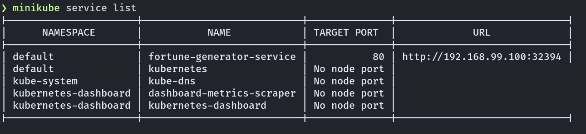

# Distributed Systems Project 2
The following is the repository for project 2. in the course of "Distributed Systems", fall semester 2020, Bachelor's degree of Computer Engineering, at the University of Aarhus about cloud computing.

## Introduction:
This project serves as an introduction to using Docker and Kubernetes, two modern technologies, used to create isoloated containers for software processes,
and orchestrate large computer clusters, as a unified ressource, making it easier to develop against and to scale horizontally.


## Dependencies: 
If you want to use the `server/fetch.js` to test the cluster response, you need to install the npm-module node-fetch. You can do this with `npm`
```sh
  npm install node-fetch
```

## Running and acessing cluster

Start a minikube cluster on your computer:
```sh
  minikube start
```

Create a deployment and a service object with Kubernetes using the command:
```sh
  kubectl create -f server/kubernetes_deployment_manifest.yaml
```

This will setup a Deployment object, which will manage a ReplicaSet, which defaults to manage 3 replicas of the fortune-cookie service, and
a Service object, which in the cluster topology sits in front of the server containers, and forward delegate request to them, in order
to loadbalance.

To see the external-IP that you can access the service at run
```sh
  minikube service list
```

The service is then available at the IP in the URL column.


You can now access the service by running a `curl` command:
```sh
  curl http://<external-ip>:<port>
```

## Load testing
For load testing we have used [vegeta](https://github.com/tsenart/vegeta). First we tested the server cluster seperately with 1,2,3,5, and 10 replicas of 
the docker image respectively, by sending 50 HTTP GET requests per second to the url of the exposed service object for 15 seconds. What the data shows is, that doing horizontal scaling didn't really affect the latency in response time. This is due to the actual work the service has to do for a request is very minimal, and therefore is easy to manage for a single node.


To simulate the work of a service which require more computational time to generate a response, we added an artificial delay of 60 ms to the request handler of the server, and then ran the same testing setup as before. 


This time the added latency made the benefits of horizontal scaling more visible.


## Report
https://www.overleaf.com/read/rthkzngkmcvh


## Authors
-   Kristoffer Plagborg Bak Sørensen
-   Alexander Stæhr Johansen
-   Jeppe Stjernholm Schildt
-   Liulihan Kuang
